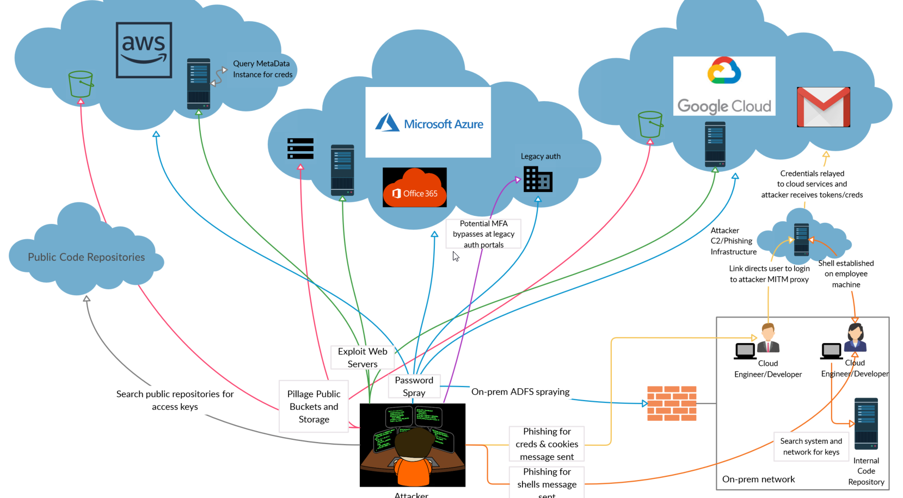

# Cloud-Penetration-Testing-and-Red-Teaming
Tools, Resources &amp; Helpful Tips




## All-in-one

### Cloud Assets Discovery 

*Spidering websites to extract cloud assets*

- using gospider 
```
gospider -d 0 -a -w -r   --js --sitemap --robots -q  -u web -s http://domain.com | sed 's|.*]||' | awk '{print $2}' | egrep -i 'azure|azurewebsites.net|cloudapp.net|core.windows.net|awsapps.com|s3.amazonaws.com|s3|blob|amazonaws.com|digitaloceanspaces|aliyuncs.com|googleapis'
```
- using lolruslove.py
```
python lolruslove.py http://domain.com  2>&1 | grep  -i url | cut -d"]" -f 2 | egrep -i 'azure|azurewebsites.net|cloudapp.net|core.windows.net|awsapps.com|s3.amazonaws.com|s3|blob|amazonaws.com|digitaloceanspaces|aliyuncs.com|googleapis' | awk '{print $2}'
```
- using shodan 
```
shodan download out-file 'hostname:<domain>' --limit -1 && sudo gunzip out-file.json.gz && sudo shodan parse --fields ip_str,port,org,hostnames,location.country_name,org,domains out-file.json | egrep -i 'azure|azurewebsites.net|cloudapp.net|core.windows.net|awsapps.com|s3.amazonaws.com|s3|blob|amazonaws.com|digitaloceanspaces|aliyuncs.com|googleapis'
```

## Azure 

## Searching for keys,secrets and others locally ( on-premise ) 
 * look for users who use Azure by searching for .Azure dir in their profiles 
 ```
 Get-ChildItem -Path C:\users\* -Recurse -Filter ".azure" | % { write-host $_.fullname -ForegroundColor green }
 ```


 
 ## Content Discovery for cloud Assets
### YAML rules to use with Nuclei Scanner 

  * Azure-Cloud-Storage-detect.yaml
  
    ```
    cat urls | nuclei -t Azure-Cloud-Storage-detect.yaml 
    ```
  * Azure-Cloud-Websites-detect.yaml 
  
    ```
    cat urls | nuclei -t Azure-Cloud-Websites-detect.yaml
    ```
-----------------------------
## AWS 

## Searching for keys,secrets and others locally ( on-premise ) 
 * look for users who use AWS by searching for .aws dir in their profiles 
 ```
 Get-ChildItem -Path C:\users\* -Recurse -Filter ".aws" | % { write-host $_.fullname -ForegroundColor green }
 ```

### YAML rules to use with Nuclei Scanner 

  * amazon-s3-detect.yaml
  
     ```
     cat urls | nuclei -t amazon-s3-detect.yaml
     ```

  * amazon-LB.yaml
  
    ```
    cat urls | nuclei -t amazon-LB.yaml
    ```
  ---------------------------
## all-in-one

## Searching for keys,secrets and others locally ( on-premise ) 

 ```
 Get-ChildItem -Path C:\users\* -Recurse -Include ('*.azure','*.aws')  | % { write-host $_.fullname -ForegroundColor green }
 ```


